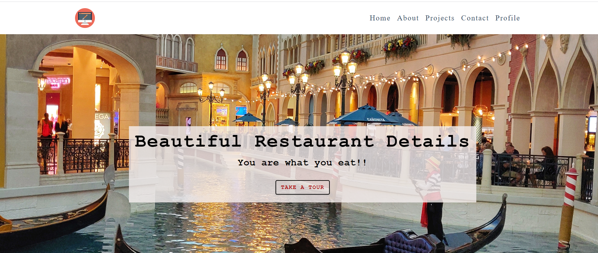

# A Full stack MERN Project -Deferent restaurant details
This is a fullstack MERN project that entails enabling user to perform CRUD operations which include 
Adding ,viewing ,deleting and updationg restaurant name ,CuisineType, location and image 

## Table of contents

- [Overview](#overview)
  - [Screenshot](#screenshot)
  - [Links](#links)
- [My process](#my-process)
  - [Built with](#built-with)
  - [What I learned](#what-i-learned)
  - [Continued development](#continued-development)
  - [Useful resources](#useful-resources)
- [Author](#author)

## Overview

### Screenshot

<video src="client/src/Navbar/images/project-overview.mp4" controls title="Project overview"></video>

Landing page 



### Links

- Back end  URL: [Add solution URL here](https://github.com/wynnei/Restaurants-MERN-)
- Live Site URL: [Add live site URL here](https://restaurant-mern-frontend.onrender.com/)

## My process

### Built with

- Semantic HTML5 markup
- CSS custom properties
- Flexbox
- CSS Grid
- Mobile-first workflow
- [React](https://reactjs.org/) - JS library
- [Next.js](https://nextjs.org/) - React framework
- [Mongo DB](https://www.mongodb.com/) - For database
- [Render](https://render.com/docs/free) - For cloud live site

### What I learned

When deploying to cloud live platform you need to change the urls on the client side of the application to enable communication with the backend because the url use for development most of the lime is local host which is locally hosted within the machine.
For example
```js
 const res = await axios.get("https://restaurant-mern.onrender.com/api/v1/restaurants");
```
Instead of 
```js
const res = await axios.get("http>//localhost:5000/api/v1/restaurants");
```

### Continued development
I would like to improve my skill on full stack projects ,JWT and DevOps

## Author

- Website - [Winnie Atieno](http://my-portfolio-project-three.vercel.app/)

## Available Scripts

In the project directory, you can run:
## Front end

#### `npm start`

Runs the app in the development mode.\
Open [http://localhost:3000](http://localhost:3000) to view it in your browser.

The page will reload when you make changes.\

#### `npm test`

Launches the test runner in the interactive watch mode.\
See the section about [running tests](https://facebook.github.io/create-react-app/docs/running-tests) for more information.

#### `npm run build`

Builds the app for production to the `build` folder.\
It correctly bundles React in production mode and optimizes the build for the best performance.

### Packages
#### Create-react-app 
#### react-file-base64
#### axios
#### testing-library/react

## Back end

#### `npm start`

Runs the app in the development mode.\
Open [http://localhost:5500/api/v1/restaurants](http://localhost:5500/api/v1/restaurants) to access the backend

The database reloads when you make changes.\

#### `npm run build`

Builds the app for production to the `build` folder.\
It correctly bundles database and node.js in production mode and optimizes the build for the best performance.

## Bult With

#### React
#### MongoDB
#### Express.js
#### Node.js

### Packages

#### cors
#### dotenv
#### mongoose
#### nodemon


